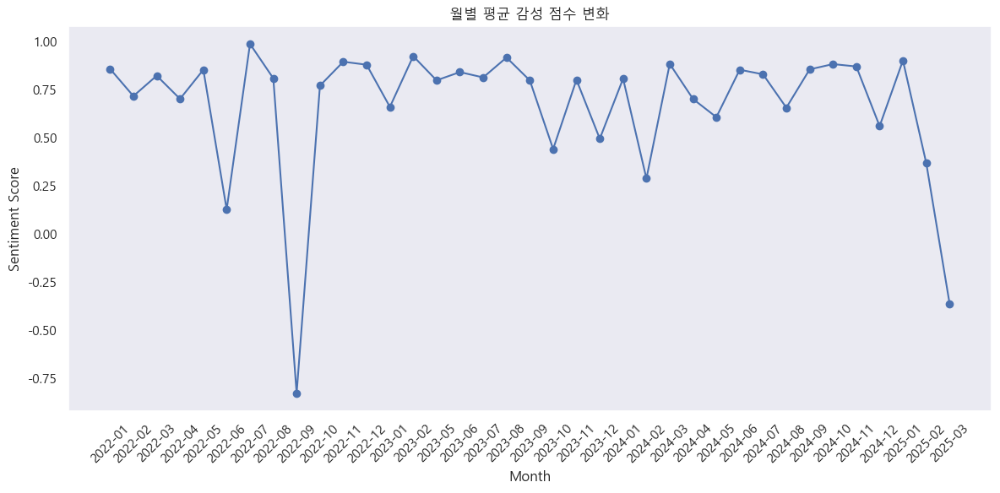
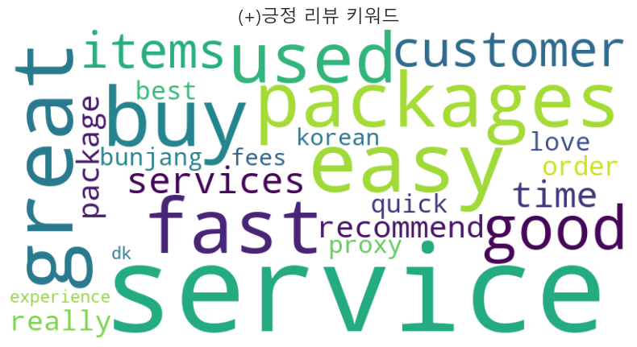
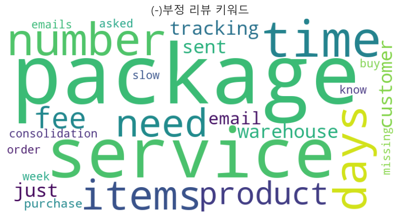
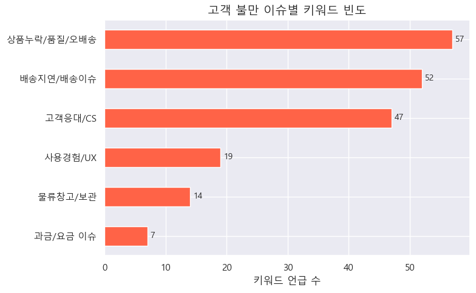
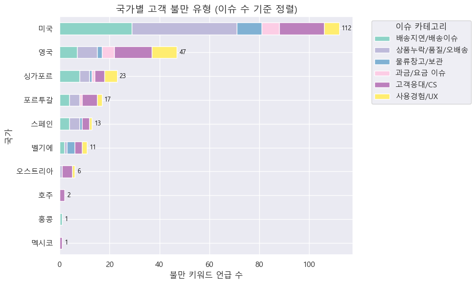

# Delivered Korea Review Analysis Project
📌 **프로젝트 목적**: Delivered Korea에 대한 사용자 리뷰를 수집하여 텍스트 마이닝 기반 감정 분석을 수행하고, 부정 리뷰를 통해 고객 불만 및 개선 방향을 도출함

## 📚 사용된 주요 라이브러리
- **기본**: `os`, `datetime`
- **웹 스크래핑**: `requests`, `BeautifulSoup4`
- **전처리 & 분석**: `pandas`, `emoji`, `contractions`, `sklearn`, `collections`
  - **감정 분석**: `vaderSentiment`, `transformers`, `tqdm`
- **시각화**: `matplotlib`, `seaborn`, `wordcloud`

---

## 1. 분석 개요
Delivered Korea의 서비스 이용 후기를 기반으로 감정 분석을 수행함. 주요 기법으로는 VADER 및 BERT 기반 감정 분석을 비교하였으며, 최종적으로 VADER 분석을 통해 상세 분석을 진행함.

💡 **분석 프로세스 개요**:
1. Trustpilot에서 Delivered Korea 리뷰 수집
2. 수집된 리뷰 데이터 정제 및 EDA 진행
3. VADER와 BERT 감정 분석 비교 → VADER 선택
4. 긍정/부정 리뷰 기반 워드 클라우드 생성
5. 부정 리뷰 추가 분석 → 불만 키워드 도출
6. 국가별 부정 리뷰 상세 분석

---

## 2. 데이터 설명
Trustpilot에서 크롤링한 데이터는 다음과 같은 항목으로 구성됨:

| 컬럼명 | 설명 |
|--------|------|
| `name` | 리뷰 작성자명 |
| `country` | 리뷰 작성자의 국적 |
| `review_count` | Trustpilot 기준 전체 리뷰 작성 수 *(해당 프로젝트에서는 분석에 사용하지 않음)* |
| `review_date` | 리뷰 작성 날짜 |
| `experience_date` | 실제 Delivered Korea 서비스 사용 날짜 |
| `title` | 리뷰 제목 |
| `content` | 리뷰 본문 |
| `star_rating` | 별점 (1~5점 척도) |

---

## 3. EDA (탐색적 데이터 분석)

### 3.1 기본 정보
- 총 리뷰 수: **240개**
  > ※ 중복 제거 및 실제 웹에서 크롤링된 수 기준 (Trustpilot 표시 수와 상이할 수 있음)
- 리뷰 작성 기간: **2022-01-22 ~ 2025-03-18**
- 별점 분포:
  - 5점: 190개 (79%)
  - 4점: 25개 (10%)
  - 3점: 5개 (2%)
  - 2점: 4개 (2%)
  - 1점: 16개 (7%)

### 3.2 국가별 리뷰 분포
- 미국: 66개 (27%)  
- 영국: 28개 (11%)  
- 캐나다: 16개 (6%)  
> 대부분의 리뷰는 상위 3개국 외에는 10개 미만이며, 미국 비중이 높은 이유는 실제 사용량 혹은 Trustpilot 사용률 때문으로 추정됨. Trustpilot 본사는 덴마크에 있으므로 후자의 가능성은 낮음.

### 3.3 서비스 이용일 vs 리뷰 작성일
- 약 50%는 서비스 이용 **당일 또는 다음날** 리뷰 작성
- 소수의 리뷰는 **이용일 이전 또는 1년 이상 경과 후 작성됨**
  > 내부 데이터와 대조가 가능하다면 더 신뢰성 있는 분석 가능할 것

---

## 4. 감정 분석: VADER vs BERT 비교

### 🔍 개요
- **VADER (Valence Aware Dictionary and sEntiment Reasoner)**  
  - 감정 어휘 사전 기반, 설치 간편, 속도 빠름  
  - 단점: 문맥 이해 부족 → 일부 긍정 단어로 인해 왜곡 가능

- **BERT (Bidirectional Encoder Representations from Transformers)**  
  - 문맥 기반 딥러닝 모델 → 복합 감정 분류에 강함  
  - 단점: 속도 느림, GPU 필요

### 4.1 성능 비교 결과
| 기법 | 정확도 |
|------|--------|
| VADER (튜닝 전) | 91.67% |
| VADER (튜닝 후) | 95.42% |
| BERT | 90.00% |

> 튜닝: 별점 기준으로 VADER 감정 결과 보정 → 낮은 별점인데도 긍정으로 분류되는 경우 가산점을 부과하여 별점과 동일한 결과가 나오도록 감정 점수를 보정함

### 4.2 VADER 기준 리뷰 감정 분포
- 긍정 (Positive): **216개**
- 중립 (Neutral): **7개**
- 부정 (Negative): **17개**

---

## 5. 추가 분석

### 5.1 감정 점수 시계열 분석
> 분석 결과: 시간 흐름에 따른 감정 점수의 유의미한 변화 없음  
📊 

---

### 5.2 워드클라우드 분석

#### 긍정 리뷰

📊 

> `fast`, `great`, `easy` → 빠르고 간편한 서비스에 대한 만족 표현

#### 부정 리뷰

📊 

> `time`, `days`, `package`, `fee`, `slow` → 배송 지연, 요금, 포장 등 문제 지적

---

### 5.3 고객 불만 키워드 분석

📊 

- 가장 많은 이슈: `item`, `package`, `number` → 상품 누락, 오배송, 품질 문제
- 다음 이슈: `time`, `response`, `late` → 배송 지연, 고객 응대 문제

> ⚠️ 단, 분석 대상 부정 리뷰 수(17개)가 적어 일부 단어 빈도가 과도하게 해석될 수 있음

---

### 5.4 국가별 부정 리뷰 상세 분석

📊 

- 각 국가별로 특정 키워드 존재하나, 리뷰 수가 적어 일반화 어려움  
> 참고용으로만 활용 권장

---
## 6. 액션 아이템 제시

1. 배송 추적 서비스 개선 및 지연 알림 시스템 고도화
   > 특히나 '직구'라는 배송서비스는 상품 발송사와 세관, 수신국의 서비스 처리속도에 영향을 받아 배송이 지연될 수 있음으로, 사용자들이 회사의 시스템이 배송지연의 원인이 아니라는 사실을 인식할 수 있는 추적 서비스 개선과 실시간 알림 시스템 구축이 필요함
3. 고객 응대 챗봇 운영이나 응답 시간 기준 수립
4. 사용자의 리뷰를 활용한 쉽고 빠른 배송 서비스를 강조한 디지털 마케팅 집행

---
## ⚠️ 해석 주의사항
- 부정 리뷰는 전체 대비 수가 적어, 키워드 분석이 과대 해석될 가능성 존재  
- 정성 분석의 보조자료로 활용 권장
